# Projeto `Bravia Escape`

# Equipe: Objetos Desorientados
* `Lucas de Paula Soares` - `RA:201867`
* `Antonio Gabriel da Silva Fernandes` - `RA:231551`

# Estrutura de Arquivos e Pastas
~~~
├── README.md          <- apresentação do projeto
│
├── data               <- arquivos .csv das fases
│
├── src                <- projeto em Java no Eclipse
│   │
│   ├── src            <- arquivos-fonte do projeto (.java)
│   │
│   ├── assets         <- cópia das mídias usadas no projeto
│   │
│   ├── stages         <- cópia dos arquivos .csv das fases
│   │
│   ├── bin            <- arquivos em bytecode (.class)
│   │
│   └── README.md      <- instruções básicas de instalação/execução
│
└── assets             <- mídias usadas no projeto
~~~

# Descrição Resumida do Projeto
Bravia é uma jovem que foi capturada por monstros e precisa fugir da masmorra usando apenas uma tocha para se guiar na escuridão.

O jogo se passa em um grid celular onde estão marcadas a entrada e a saída daquela fase. Para alcançar a saída, será necessário encontrar chaves certas que abrem portas que liberam o caminho. O jogador pode se mover nas quatro direções, em células que não contêm obstáculos.

Na caverna, podemos encontrar também monstros que perseguem nossa heroína. Alguns deles rondam os corredores procurando por ela enquanto outros ficam de guarda escondidos até serem encontrados. Assim que entram no raio da tocha de Bravia, eles começam a persegui-la, até serem despistados. Os monstros se movem uma vez para cada movimento feito pelo jogador, e não conseguem passar por portões (mesmo destrancados).

Em fases mais longas, haverá uma fogueira que pode ser acesa por Bravia, que
funcionará como checkpoint. Essas fogueiras iluminam uma área a seu redor depois de
acesas, e estarão dentro de uma área cercada por paredes e acessível apenas por portões, o que as torna espaços seguros de monstros.

# Vídeos do Projeto
## Vídeo da Prévia

## Vídeo do Jogo

# Slides do Projeto
## Slides da prévia
[Link para slides](https://docs.google.com/presentation/d/1SCRml4NGaG-R9hetl57H_yJrgA6-L83-OzihDUgYVMk/edit?usp=sharing)

## Slides da Apresentação Final

# Relatório de Evolução
Ao longo do desenvolvimento do projeto, diversas mudanças foram feitas à medida que percebemos formas melhores de implementar certas mecânicas, ou simplesmente que certas mecânicas não eram estritamente necessárias para o jogo, simplesmente adicionando tempo de desenvolvimento sem necessariamente agregar valor.

O componente `MapGenerator` foi totalmente repensado, agora com o nome de `GameBuilder` (por implementar o design pattern Builder). Ele também agora interage com duas outras classes, `EnemyFactory` e `CellFactory` (que implementam o design pattern Factory). A ideia geral de gerar um objeto `Map` através de um arquivo .csv foi mantida, mas foi implementada de forma muito mais elegante usando esses design patterns. Ele também é responsável por instanciar um objeto `Bravia`, por isso se chama `GameBuilder`, não `MapBuilder`.

Foram criados dois tipos diferentes de `Enemy`, o `EnemyHunter`, que patrulha o mapa em busca do jogador, e o `EnemyGuardian`, que aguarda escondido até ser descoberto, e a classe `Enemy` agora é abstrata. Isso permite melhor expansibilidade e variedade de tipos de inimigos.

Foi criada a classe e componente `Checkpoint`, que lida com as informações de respawn de Bravia, ou seja, guarda o estado do jogo assim que o jogador aciona um checkpoint (fogueira ou nova fase) e fornece essas informações para que possam ser restauradas quando Bravia morre. Seus métodos são todos estáticos, o que facilita o acesso por diferentes classes.

Foi abandonada a ideia de ter baús com itens nas fases. Embora seja uma ideia interessante, tomaria muito tempo de desenvolvimento e acreditamos que o jogo já esteja perfeitamente funcional e divertido sem eles. Seria um bom ponto para começar caso o desenvolvimento seja retomado. Assim, todas as classes, métodos e atributos relacionados a essa mecânica foram excluídos.

A principal dificuldade durante o desenvolvimento foi decidir detalhes sobre o funcionamento dos Enemies, com relação a como se movimentam, se são iluminados ou não, entre outros, além da própria implementação da lógica por trás disso. Também foi difícil utilizar o polimorfismo nas células de forma efetiva, usando o método `activate()`, principalmente devido a diferentes células precisarem de acesso a diferentes objetos e informações para seus próprios métodos `activate()`, principalmente `Bonfire` e `Exit`.

# Destaques de Código

# Destaques de Pattern

# Conclusões e Trabalhos Futuros

# Diagramas

## Diagrama Geral do Projeto

## Diagrama Geral de Componentes
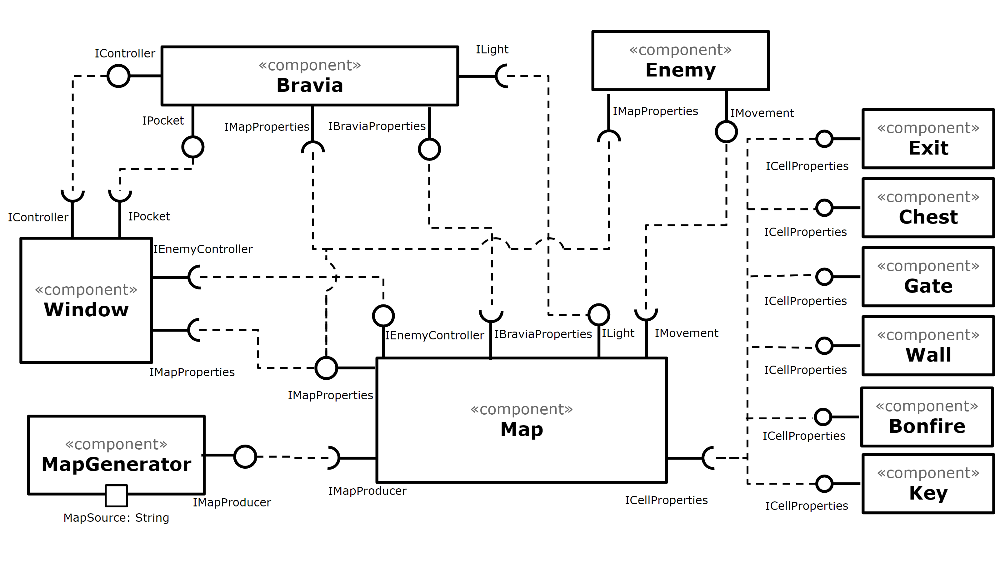

## Componente `MapGenerator`
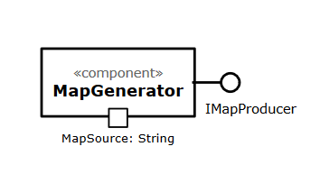

## Interfaces
Interfaces associadas a esse componente:

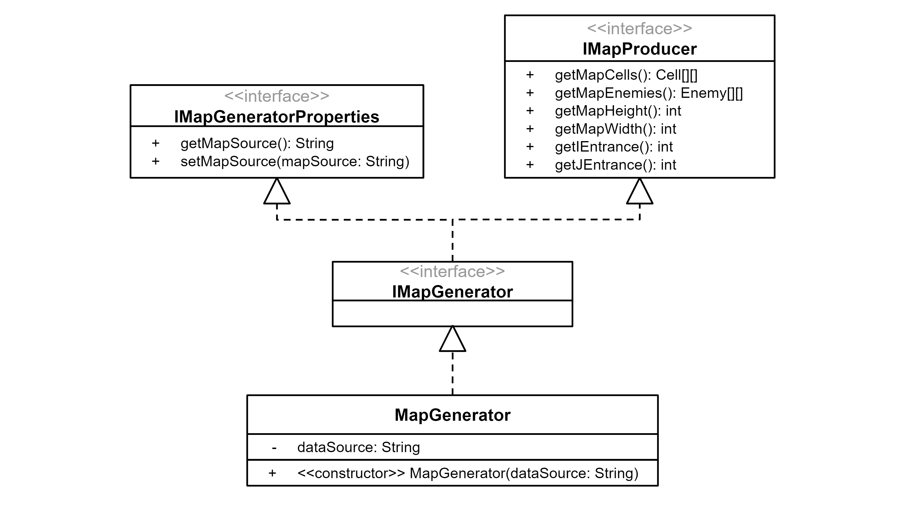

Campo | Valor
----- | -----
Classe | map.MapGenerator
Autores | Antonio Gabriel da Silva Fernandes   Lucas de Paula Soares
Objetivo | Gerar um mapa no jogo a partir de um arquivo .csv
Interface | IMapGenerator

~~~
public interface IMapGeneratorProperties {
  String getMapSource();
  void setMapSource(String mapSource);
}

public interface IMapProducer {
  Cell[][] getMapCells();
  Enemy[][] getMapEnemies();
  int getMapHeight();
  int getMapWidth();
  int getIEntrance();
  int getJEntrance();
}

public interface IMapGenerator extends IMapGeneratorProperties, IMapProducer {
}
~~~

## Detalhamento das Interfaces
### Interface `IMapGeneratorProperties`

Interface que provê acesso às propriedades internas do componente `MapGenerator`.

Método | Objetivo
-------| --------
` String getMapSource()`  |  Retorna uma string com o caminho para o arquivo .csv do qual o mapa está sendo lido
`void setMapSource(String mapSource)` | Define o caminho para o arquivo .csv do qual o mapa será lido

### Interface `IMapProducer`
Interface que provê acesso ao mapa produzido pelo `MapGenerator`

Método | Objetivo
-------| --------
`Cell[][] getMapCells()` | Retorna uma matriz de objetos do tipo Cell, representando a camada estática do mapa
`Enemy[][] getMapEnemies()` | Retorna uma matriz de objetos do tipo Enemy, representando as posições iniciais dos inimigos no mapa
`int getMapHeight()`  | Retorna a altura do mapa (quantidade de linhas)
`int getMapWidth()` | Retorna a largura do mapa (quantidade de colunas)
`int getIEntrance()` | Retorna a coordenada i da entrada do mapa (posição inicial de Bravia)
`int getJEntrance()` | Retorna a coordenada j da entrada do mapa (posição inicial de Bravia)

# Componente `Map`
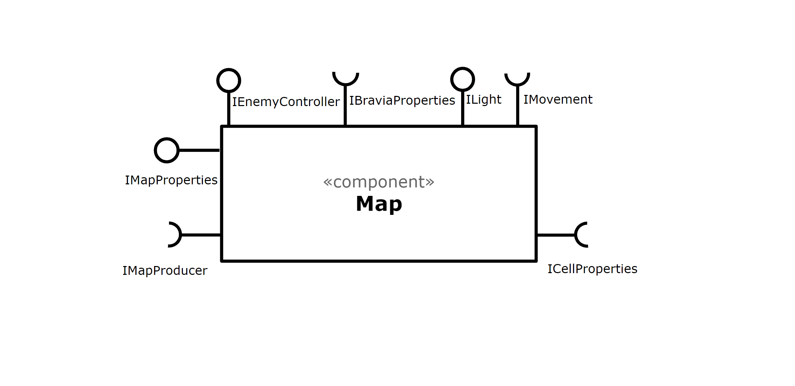

## Interfaces
Interfaces associadas a esse componente:

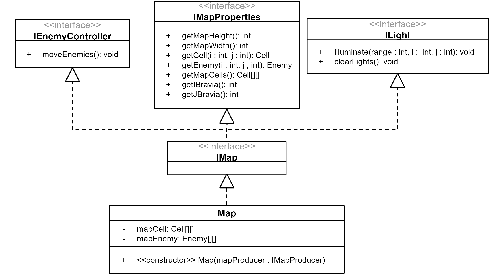

Campo | Valor
----- | -----
Classe | map.Map
Autores | Antonio Gabriel da Silva Fernandes   Lucas de Paula Soares
Objetivo | Representar o mapa do jogo
Interface | IMap

~~~
public interface IEnemyController {
  void moveEnemies();
}

public interface IMapProperties {
  int getMapHeight();
  int getMapWidth();
  Cell getCell(int i, int j);
  Enemy getEnemy(int i, int j);
  Cell[][] getMapCells();
  int getIBravia();
  int getJBravia();
}

public interface ILight {
  void illuminate(int range, int i, int j);
  void clearLights();
}

public interface IMap extends IEnemyController, IMapProperties, ILight {
}
~~~

## Detalhamento das Interfaces

### Interface `IEnemyController`
Interface responsável por controlar o movimento dos Enemies.

Método | Objetivo
-------| --------
`void moveEnemies()` | Comunica ao Map para para os inimigos se moverem

### Interface `IMapProperties`
Interface que provê acesso às propriedades do mapa.

Método | Objetivo
-------| --------
`int getMapHeight()` | Retorna a altura do mapa (quantidade de linhas)
`int getMapWidth()` | Retorna a largura do mapa (quantidade de colunas)
`Cell getCell(int i, int j)` | Retorna a célula na posição de coordenadas (i, j)
`Enemy getEnemy(int i, int j)` | Retorna o inimigo que estiver nas coordenadas (i, j), null caso não tenha
`Cell[][] getMapCells()` | Retorna uma matriz de objetos do tipo Cell, representando a camada estática do mapa
`int getIBravia()` | Retorna a coordenada i atual de Bravia
`int getJBravia()` | Retorna a coordenada j atual de Bravia

### Interface `ILight`
Interface que provê acesso às propriedades de iluminação do mapa.

Método | Objetivo
-------| --------
`void illuminate(int range, int i, int j)` | Ilumina as células em um raio "range" ao redor da posição (i, j)
`void clearLights()` | Desilumina todas as células que não estão permanentemente iluminadas

# Componente `Bravia`
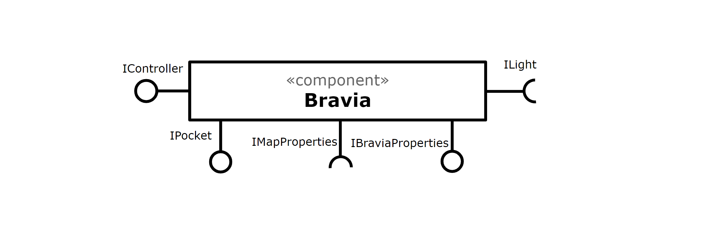

## Interfaces
Interfaces associadas a esse componente:

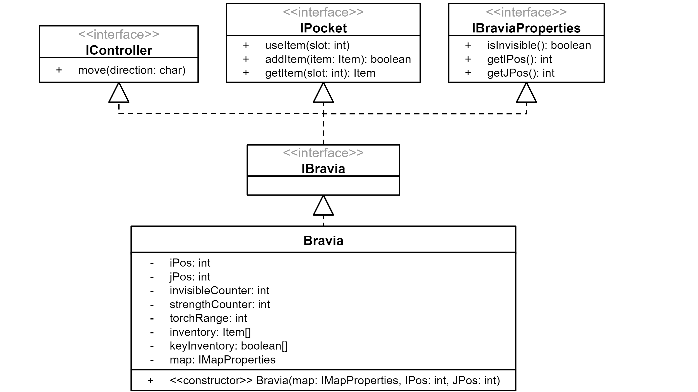

Campo | Valor
----- | -----
Classe | bravia.Bravia
Autores | Antonio Gabriel da Silva Fernandes   Lucas de Paula Soares
Objetivo | Representar a personagem principal do jogo, Bravia
Interface | IBravia

~~~
public interface IController {
  void move(char direction);
}

public interface IPocket {
  void useItem(int slot);
  void addItem(Item item);
  Item getItem(int slot);
}

public interface IBraviaProperties {
  boolean isInvisible();
  int getIpos();
  int getJpos();
}

public interface IBravia extends IController, IPocket, IBraviaProperties {
}
~~~

## Detalhamento das Interfaces

### Interface `IController`
Interface responsável por controlar o movimento de Bravia.

Método | Objetivo
-------| --------
`void move(char direction)` | Comunica a Bravia em qual direção ela deve andar, Up ''U'', Down "D", Right "R" ou Left "L".

### Interface `IPocket`
Interface que provê acesso ao inventário de Bravia.

Método | Objetivo
-------| --------
`void useItem(int slot)` | Retira o item que está no slot especificado do inventário e aplica seu efeito
`void addItem(Item item)` | Adiciona o item ao inventário, se houver espaço
`Item getItem(int slot)` | Retorna o item no slot do inventário, null caso não tenha

### Interface `IBraviaProperties`
Interface que provê acesso a propriedades gerais de Bravia.

Método | Objetivo
-------| --------
`boolean isInvisible()` | Retorna true caso Bravia esteja invisível (por efeito de uma poção), false caso contrário
`int getIpos()` | Retorna a coordenada i atual de Bravia
`int getJpos()` | Retorna a coordenada j atual de Bravia

# Componente `Enemy`
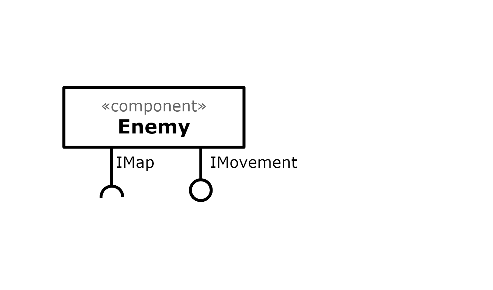

## Interfaces
Interfaces associadas a esse componente:

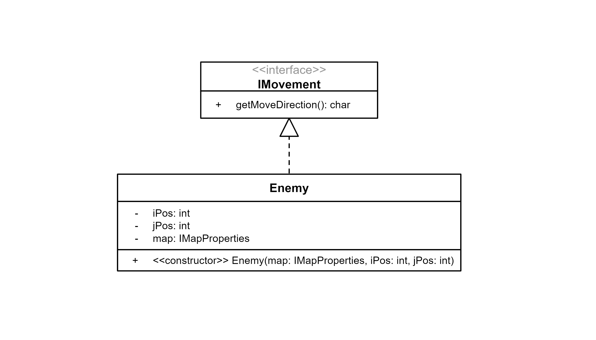

Campo | Valor
----- | -----
Classe | enemy.Enemy
Autores | Antonio Gabriel da Silva Fernandes   Lucas de Paula Soares
Objetivo | Representar os inimigos no jogo
Interface | IMovement

~~~
public interface IMovement {
  char getMoveDirection();
}
~~~

## Detalhamento das Interfaces

### Interface `IMovement`
Interface responsável por controlar o movimento do Enemy.

Método | Objetivo
-------| --------
`char getMoveDirection()` | Retona um char que depende da direção na qual o Enemy irá fazer seu próximo movimento: Up ''U'', Down "D", Right "R" ou Left "L".

# Componente `Window`
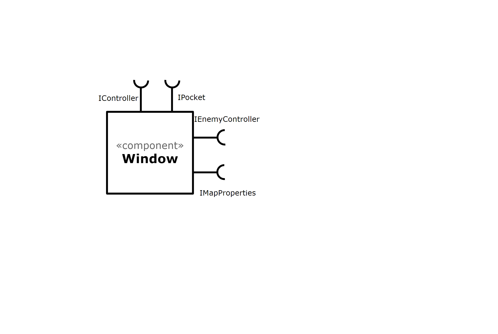

## Classe
Classe associada a esse componente:

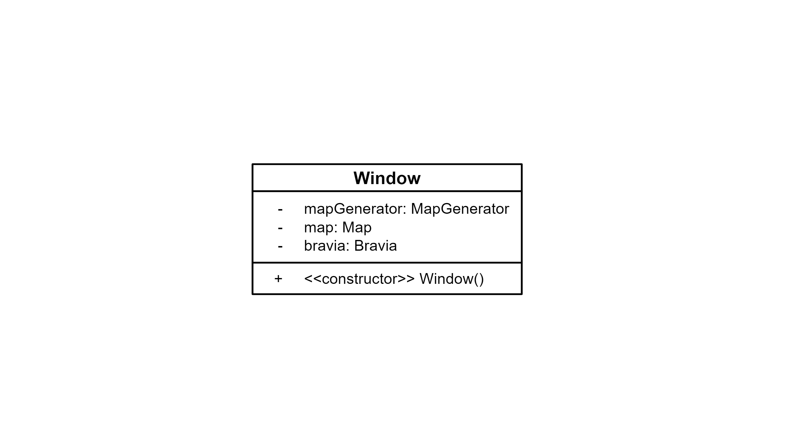

Campo | Valor
----- | -----
Classe | main.Window
Autores | Antonio Gabriel da Silva Fernandes   Lucas de Paula Soares
Objetivo | Representar a janela do jogo
Interface | -

# Componentes `Cell`
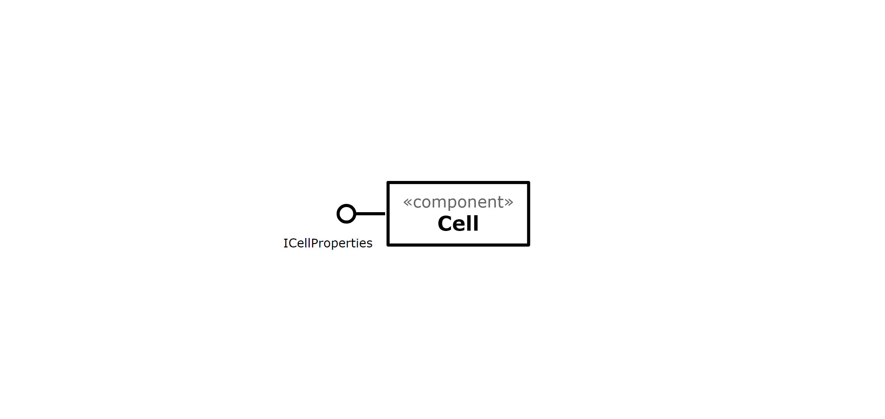

## Interfaces
Interfaces associadas a esse componente:

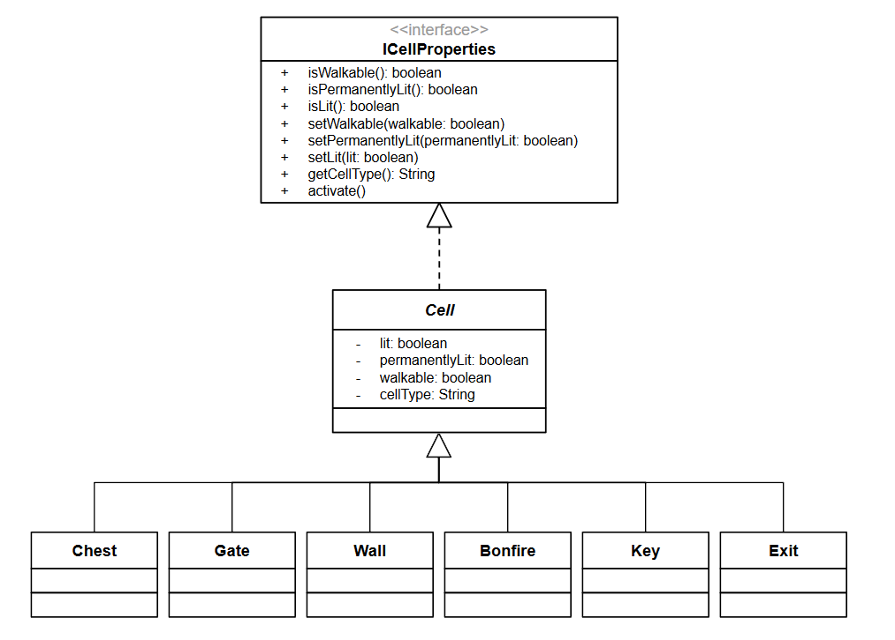

Campo | Valor
----- | -----
Classes | cells.Cell   cells.Chest   cells.Gate   cells.Wall   cells.Bonfire   cells.Key   cells.Exit  
Autores | Antonio Gabriel da Silva Fernandes   Lucas de Paula Soares
Objetivo | Representar as células no grid
Interface | ICellProperties

~~~
public interface ICellProperties {
  boolean isWalkable();
  boolean isPermanentlyLit();
  boolean isLit();
  setWalkable(boolean walkable);
  void setPermanentlyLit(boolean permanentlyLit);
  void setLit(boolean lit);
  String getCellType();
  void activate();
}
~~~

## Detalhamento das Interfaces

### Interface `ICellProperties`
Interface que provê as propriedades de uma célula.

Método | Objetivo
-------| --------
`boolean isWalkable()` | Retorna true caso seja possível andar por cima da célula, false caso contrário
`boolean isPermanentlyLit()` | Retorna true se a célula tem iluminação permanente, false caso contrário
`boolean isLit()` | Retorna se a célula está ou não iluminada
`setWalkable(boolean walkable)` | Define que é possível andar sobre a célula, se o parâmetro for true, ou que não é possível caso contrário
`void setPermanentlyLit(boolean permanentlyLit)` | Define que a célula tem iluminação permanente, se o parâmetro for true, ou que não tem caso contrário
`void setLit(boolean lit)` | Define o estado da célula como iluminado, se o parâmetro for true, ou como não iluminada caso contrário
`String getCellType()` | Retorna uma string baseado no seu tipo e seu estado atual
`void activate()` | Ativa a célula, fazendo com que ela mude seu estado com base no seu tipo (uma fogueira se torna uma fogueira acesa, por exemplo)

### Strings associadas a cada tipo de célula:
Tipo de célula | String
----- | -----
Nada | `--`
Wall | `Wa`
Gate (color X) | `GX`
Bonfire | `Bf`
Key (color X) | `KX`
Chest | `Ch`
Exit | `Ex`
Enemy | `MX`

# Plano de Exceções
## Diagrama da hierarquia de exceções
## Descrição das classes de exceção
