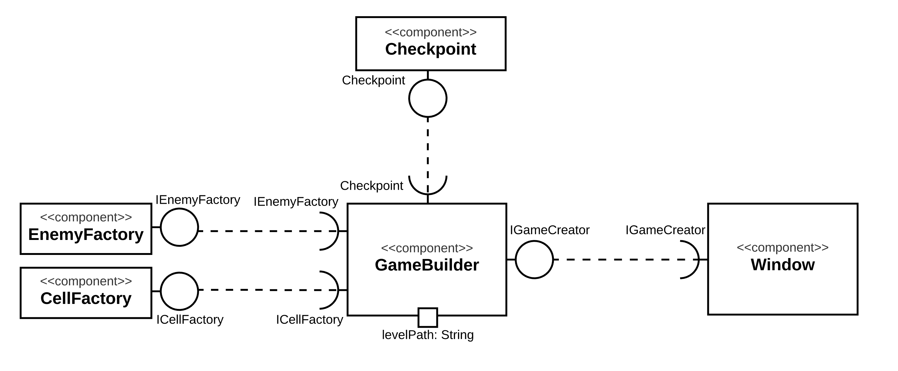
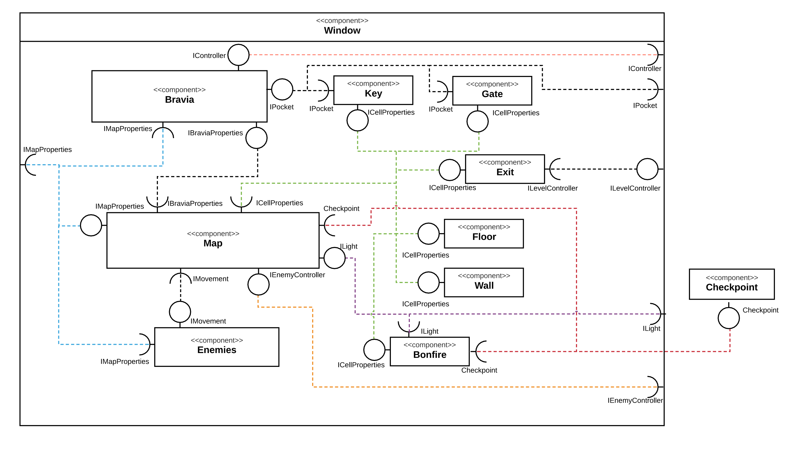

# Projeto `Bravia Escape`

# Equipe: Objetos Desorientados
* `Lucas de Paula Soares` - `RA:201867`
* `Antonio Gabriel da Silva Fernandes` - `RA:231551`

# Estrutura de Arquivos e Pastas
~~~
├── README.md          <- apresentação do projeto
│
├── data               <- arquivos .csv das fases
│
├── src                <- projeto em Java no Eclipse
│   │
│   ├── src            <- arquivos-fonte do projeto (.java)
│   │
│   ├── assets         <- cópia das mídias usadas no projeto
│   │
│   ├── stages         <- cópia dos arquivos .csv das fases
│   │
│   ├── bin            <- arquivos em bytecode (.class)
│   │
│   └── README.md      <- instruções básicas de instalação/execução
│
└── assets             <- mídias usadas no projeto
~~~

# Descrição Resumida do Projeto
Bravia é uma jovem que foi capturada por monstros e precisa fugir da masmorra usando apenas uma tocha para se guiar na escuridão.

O jogo se passa em um grid celular onde estão marcadas a entrada e a saída daquela fase. Para alcançar a saída, será necessário encontrar chaves certas que abrem portas que liberam o caminho. O jogador pode se mover nas quatro direções, em células que não contêm obstáculos.

Na caverna, podemos encontrar também monstros que perseguem nossa heroína. Alguns deles rondam os corredores procurando por ela (Hunters) enquanto outros ficam de guarda escondidos até serem encontrados (Guardians). Assim que entram no raio da tocha de Bravia, eles começam a persegui-la, até serem despistados. Os monstros se movem uma vez para cada movimento feito pelo jogador, e não conseguem passar por portões (mesmo destrancados).

Em fases mais longas, haverá uma fogueira que pode ser acesa por Bravia, que
funcionará como checkpoint. Essas fogueiras iluminam uma área a seu redor depois de
acesas, e estarão dentro de uma área cercada por paredes e acessível apenas por portões, o que as torna espaços seguros de monstros.

# Vídeos do Projeto
## Vídeo da Prévia

## Vídeo do Jogo

# Slides do Projeto
## Slides da prévia
[Link para slides da prévia](https://docs.google.com/presentation/d/1SCRml4NGaG-R9hetl57H_yJrgA6-L83-OzihDUgYVMk/edit?usp=sharing)

## Slides da Apresentação Final
[Link para slides da apresentação final]()

# Relatório de Evolução
Ao longo do desenvolvimento do projeto, diversas mudanças foram feitas à medida que percebemos formas melhores de implementar certas mecânicas, ou simplesmente que certas mecânicas não eram estritamente necessárias para o jogo, simplesmente adicionando tempo de desenvolvimento sem necessariamente agregar valor.

O componente `MapGenerator` foi totalmente repensado, agora com o nome de `GameBuilder` (por implementar o design pattern Builder). Ele também agora interage com duas outras classes, `EnemyFactory` e `CellFactory` (que implementam o design pattern Factory). A ideia geral de gerar um objeto `Map` através de um arquivo .csv foi mantida, mas foi implementada de forma muito mais elegante usando esses design patterns. Ele também é responsável por instanciar um objeto `Bravia`, por isso se chama `GameBuilder`, não `MapBuilder`.

Foram criados dois tipos diferentes de `Enemy`, o `EnemyHunter`, que patrulha o mapa em busca do jogador, e o `EnemyGuardian`, que aguarda escondido até ser descoberto, e a classe `Enemy` agora é abstrata. Isso permite melhor expansibilidade e variedade de tipos de inimigos.

Foi criada a classe e componente `Checkpoint`, que lida com as informações de respawn de Bravia, ou seja, guarda o estado do jogo assim que o jogador aciona um checkpoint (fogueira ou nova fase) e fornece essas informações para que possam ser restauradas quando Bravia morre. Seus métodos são todos estáticos, o que facilita o acesso por diferentes classes.

Foi abandonada a ideia de ter baús com itens nas fases. Embora seja uma ideia interessante, tomaria muito tempo de desenvolvimento e acreditamos que o jogo já esteja perfeitamente funcional e divertido sem eles. Seria um bom ponto para começar caso o desenvolvimento seja retomado. Assim, todas as classes, métodos e atributos relacionados a essa mecânica foram excluídos.

A principal dificuldade durante o desenvolvimento foi decidir detalhes sobre o funcionamento dos Enemies, com relação a como se movimentam, se são iluminados ou não, entre outros, além da própria implementação da lógica por trás disso. Também foi difícil utilizar o polimorfismo nas células de forma efetiva, usando o método `activate()`, principalmente devido a diferentes células precisarem de acesso a diferentes objetos e informações para seus próprios métodos `activate()`, principalmente `Bonfire` e `Exit`.

# Destaques de Código

# Destaques de Pattern

## Pattern Factory
### Diagrama do Pattern

### Código do Pattern
Em CellFactory.java:
~~~java
public Cell getCell(String objectID, Window window, Map mapGenerated, int iPos, int jPos) {
    char first = objectID.charAt(0);
    switch (first) {
    case '-':  //piso
        return new Floor(iPos,jPos);
    case 'W':  //Wall
        return new Wall(iPos,jPos);
    case 'G':  //Gate
        return new Gate(iPos,jPos,Color.getColor(objectID.charAt(1) - '0'));
    case 'B':  //Bonfire
        return new Bonfire(iPos,jPos, mapGenerated);
    case 'K':  //Key
        return new Key(iPos,jPos,Color.getColor(objectID.charAt(1) - '0'));
    case 'E':  //Exit
        return new Exit(iPos, jPos, window);
    default:
        return new Floor(iPos,jPos);
    }
}
~~~

Em EnemyFactory.java:
~~~java
public Enemy getEnemy(String objectID, Map mapGenerated, int iPos, int jPos) {
    if(objectID.charAt(0) == 'M') {
        switch (objectID.charAt(1)) {
        case '0':
            return new EnemyGuardian(mapGenerated,iPos,jPos);
        case '1':
            return new EnemyHunter(mapGenerated,iPos,jPos);
        default:
            return null;
        }
    }
    return null;
}
~~~

Em GameBuilder.java:
~~~java
private void loadGame() throws InvalidMapGen {
    try {
        <...>
        for(int i=0; i < this.mapHeight; i++) {
            <...>
            ICellFactory cellFactory = new CellFactory();
            IEnemyFactory enemyFactory = new EnemyFactory();

            for(int j=0; j < this.mapWidth; j++) {
                <...>
                mapText[i][j] = objectID;
                mapEnemy[i][j] = enemyFactory.getEnemy(objectID, mapGenerated, i, j);
                mapCell[i][j] = cellFactory.getCell(objectID, window, mapGenerated, i, j);
            }
        }
        <...>
    } catch (IOException error) {
        error.printStackTrace();
    }
}
~~~
No nosso projeto, o pattern Factory foi utilizado para a instanciação fácil de objetos dos tipos `Cell` e `Enemy`. Criamos, portanto, duas factories, a `CellFactory` e a `EnemyFactory`, com os métodos `getCell()` e `getEnemy()`, respectivamente. Esses métodos, a partir dos parâmetros passados, retornam objetos da classe apropriada. Essas factories são chamadas pela classe `GameBuilder`, no método `loadGame()`, e são utilizadas para montar as matrizes de células e de inimigos que farão parte do mapa a ser construído pela `GameBuilder`.

Dessa forma, a `GameBuilder` atua como cliente de ambas as factories, cujos produtos são ou objetos do tipo `Cell` ou objetos do tipo `Enemy`.

## Pattern Builder
### Diagrama do Pattern

### Código do Pattern
Em GameBuilder.java:
~~~java
/** Carrega informações do Map e Bravia que serão criados **/
private void loadGame() throws InvalidMapGen {
  try {
      BufferedReader file = new BufferedReader(new FileReader(this.mapSource));
      <...>
      setMapHeight(Integer.parseInt(lineSplit[0]));
      setMapWidth(Integer.parseInt(lineSplit[1]));

      <...>
      setIEntrance(Integer.parseInt(lineSplit[0]));
      setJEntrance(Integer.parseInt(lineSplit[1]));

      /** criar matriz mapa vazia **/
      mapText = new String[this.mapHeight][this.mapWidth];
      mapCell = new Cell[this.mapHeight][this.mapWidth];
      mapEnemy = new Enemy[this.mapHeight][this.mapWidth];

      /** preencher matriz mapa **/
      for(int i=0; i < this.mapHeight; i++) {
          < ... >
          ICellFactory cellFactory = new CellFactory();
          IEnemyFactory enemyFactory = new EnemyFactory();

          for(int j=0; j < this.mapWidth; j++) {
              String objectID = lineSplit[j];
              if(objectID == "Ex") exit = true;
              mapText[i][j] = objectID;
              mapEnemy[i][j] = enemyFactory.getEnemy(objectID, mapGenerated, i, j);
              mapCell[i][j] = cellFactory.getCell(objectID, window, mapGenerated, i, j);
          }
      }
      < ... >
  } catch (IOException error) {
      error.printStackTrace();
  }
}

/** Constroi o objeto Map e o objeto Bravia **/
private void buildGame() {
    mapGenerated.setMapCell(mapCell);
    mapGenerated.setMapEnemy(mapEnemy);
    mapGenerated.setMapHeight(mapHeight);
    mapGenerated.setMapWidth(mapWidth);
    mapGenerated.setBravia(new Bravia(mapGenerated, IEntrance, JEntrance));
    braviaGenerated = mapGenerated.getBravia();
    <...>
}

/** Retorna o objeto Map **/
public Map getMap() {
    return mapGenerated;
}

/** Retorna o objeto Bravia **/
public Bravia getBravia() {
    return braviaGenerated;
}
~~~

Em Window.java:
~~~java
public Window(String levelPath){
	<...>

	IGameCreator gameCreator;
	try {
			gameCreator = new GameBuilder(this,levelPath);
			map = gameCreator.getMap();
			bravia = gameCreator.getBravia();
			<...>
	} catch (InvalidMapGen error) {
			error.printStackTrace();
			JOptionPane.showMessageDialog(null, "Erro no " + levelPath);
			frame.dispose();
			new Menu();
	}
}
~~~
No nosso projeto, o pattern Builder foi implementado na construção do jogo. Temos a classe `GameBuilder`, que, a partir do caminho de um arquivo .csv, constrói um objeto `Map` e um objeto `Bravia` de acordo com a especificação do arquivo.

Ao ser instanciado, em seu construtor, o `GameBuilder` chama seu método `loadGame()` e depois seu método `buildGame()`. O primeiro é responsável por processar as informações do arquivo .csv e criar as matrizes que compõem o mapa. O segundo faz a montagem propriamente dita, tanto do mapa quanto da Bravia, para que eles possam ser depois retornados pelos métodos `getMap()` e `getBravia()`, que são chamados pela classe `Window` durante o processo de inicialização da fase.

Assim, a `Window` atua como cliente para o `GameBuilder` e o `Map` e a `Bravia` são os produtos sendo construídos.

# Conclusões e Trabalhos Futuros
No geral, foi uma experiência muito interessante construir esse jogo porque nos deparamos com problemas que simplesmente não aparecem em projetos menores. Estávamos constantemente nos preocupando em tornar nosso trabalho no futuro mais fácil, e projetar o código de forma que fosse o mais simples possível adicionar novas funcionalidades e fazer alterações em coisas já existentes, o que vai bastante de acordo com a premissa do curso de orientação a objetos. Pensar no jogo em termos de componentes independentes contribuiu bastante para essa facilitação.

Houve algumas coisas aprendidas ao longo do curso que não conseguimos aplicar como gostaríamos, principalmente por falta de tempo. A principal foi o uso de exceções. Com mais tempo, poderíamos ter criado um plano de exceções mais efetivo para avaliar a validez dos arquivos .csv usados para gerar as fases, definindo se a fase é de fato "passável" ou não. Também poderíamos ter tratado alguns desses erros, como um tamanho inválido de mapa que simplesmente foi escrito errado (embora a matriz em si tenha dimensões válidas), em vez de apenas voltar para o menu principal.

Também gostaríamos de ter implementado de forma mais efetiva o uso de interfaces. As interfaces usadas no nosso trabalho acabaram sendo pouco úteis, servindo apenas como filtros em algumas situações, e um plano de para trabalhos futuros seria refinar esse aspecto.

# Diagramas

## Diagrama Geral do Projeto

## Diagrama Geral de Componentes

## Componente `GameBuilder`
Componente responsável por, para cada fase, gerar um objeto Map e Bravia a partir de um arquivo .csv descrevendo a fase. Os arquivos .csv devem estar na pasta src/stages, e devem seguir o seguinte formato:
- **Primeira linha:** `X, Y`, onde X é a altura e Y é a largura do mapa.
- **Segunda linha:** `I, J`, onde (I, J) são as coordenadas iniciais de Bravia
- **X linhas seguintes:** Devem ter Y elementos cada, cada um desses elementos correspondendo a uma célula ou inimigo no mapa, de acordo com a tabela:

Tipo de célula | String
----- | -----
Floor | `--`
Wall | `Wa`
Gate (color X) | `GX`
Bonfire | `Bf`
Key (color X) | `KX`
Exit | `Ex`
Enemy (type X) | `MX`

O índice da cor das chaves/portões pode variar de 0 a 3:

Índice | Cor
----- | -----
0 | Azul
1 | Verde
2 | Vermelho
3 | Amarelo

O tipo do inimigo pode ser 0 ou 1:

Índice | Tipo
----- | -----
0 | Guardian
1 | Hunter

Os nomes dos arquivos na pasta src/stages devem todos seguir o formato "levelN.csv", onde N é um inteiro. Os números das fases devem começar em 1 e não se deve pular números.

**Ficha Técnica**

Campo | Valor
----- | -----
Classe | map.GameBuilder
Autores | Antonio Gabriel da Silva Fernandes   Lucas de Paula Soares
Interface | IMapGenerator

### Interfaces
Interfaces associadas a esse componente:

## Detalhamento das Interfaces
### Interface `IGameCreator`
Interface que provê acesso aos serviços da Factory.
~~~java
public interface IGameCreator {
	public Map getMap();
	public Bravia getBravia();
}
~~~

Método | Objetivo
-------| --------
`Map getMap()`  |  Retorna o objeto tipo Map associado ao jogo criado
`Bravia getBravia()` | Retorna o objeto tipo Bravia associado ao jogo criado

## Componente `CellFactory`
Componente responsável por criar objetos Cell da classe apropriada dependendo dos argumentos passados a ele.

**Ficha Técnica**

Campo | Valor
----- | -----
Classe | map.CellFactory
Autores | Antonio Gabriel da Silva Fernandes   Lucas de Paula Soares
Interface | ICellFactory

### Interfaces
Interfaces associadas a esse componente:

## Detalhamento das Interfaces
### Interface `ICellFactory`

Interface que provê acesso ao método da Factory.
~~~java
public interface ICellFactory {
	public Cell getCell(String objectID, Window window, Map mapGenerated, int iPos, int jPos);
}
~~~

Método | Objetivo
-------| --------
`Cell getCell(String objectID, Window window, Map mapGenerated, int iPos, int jPos)`  |  Retorna um objeto Cell cuja classe depende do parâmetro objectID

## Componente `EnemyFactory`
Componente responsável por criar objetos Enemy da classe apropriada dependendo dos argumentos passados a ele.

**Ficha Técnica**

Campo | Valor
----- | -----
Classe | map.EnemyFactory
Autores | Antonio Gabriel da Silva Fernandes   Lucas de Paula Soares
Interface | IEnemyFactory

### Interfaces
Interfaces associadas a esse componente:

## Detalhamento das Interfaces
### Interface `IEnemyFactory`

Interface que provê acesso ao método da Factory.
~~~java
public interface IEnemyFactory {
	public Enemy getEnemy(String objectID, Map mapGenerated, int iPos, int jPos);
}
~~~

Método | Objetivo
-------| --------
`public Enemy getEnemy(String objectID, Map mapGenerated, int iPos, int jPos)`  |  Retorna um objeto Enemy cuja classe depende do parâmetro objectID

## Componente `Map`
Componente responsável por representar o mapa do jogo.

**Ficha Técnica**

Campo | Valor
----- | -----
Classe | map.Map
Autores | Antonio Gabriel da Silva Fernandes   Lucas de Paula Soares
Interfaces | IMapProperties   IEnemyController   ILight

### Interfaces
Interfaces associadas a esse componente:

Interface agregadora do componente em Java:
~~~java
public interface IMap extends IEnemyController, IMapProperties, ILight {
}
~~~

## Detalhamento das Interfaces

### Interface `IEnemyController`
Interface responsável por controlar o movimento dos Enemies.
~~~java
public interface IEnemyController {
  void moveEnemies();
}
~~~
Método | Objetivo
-------| --------
`void moveEnemies()` | Comunica ao Map para para os inimigos se moverem

### Interface `IMapProperties`
Interface que provê acesso às propriedades do mapa.
~~~java
public interface IMapProperties {
	int getMapHeight();
	int getMapWidth();
	void setMapHeight(int mapHeight);
	void setMapWidth(int mapWidth);
	Cell getCell(int i, int j);
	Enemy getEnemy(int i, int j);
	Cell[][] getMapCell();
	Enemy[][] getMapEnemy();
	void setMapCell(Cell[][] mapCell);
	void setMapEnemy(Enemy[][] mapEnemy);
	Bravia getBravia();
	void setBravia(Bravia bravia);
	int getIBravia();
	int getJBravia();
	ArrayList<Enemy> listEnemies();
}
~~~

Método | Objetivo
-------| --------
`int getMapHeight()` | Retorna a altura do mapa (quantidade de linhas)
`int getMapWidth()` | Retorna a largura do mapa (quantidade de colunas)
`void setMapHeight(int mapHeight)` | Define a altura do mapa (quantidade de linhas)
`void setMapWidth(int mapWidth)` | Define a largura do mapa (quantidade de colunas)
`Cell getCell(int i, int j)` | Retorna a célula na posição de coordenadas (i, j)
`Enemy getEnemy(int i, int j)` | Retorna o inimigo que estiver nas coordenadas (i, j), null caso não tenha
`Cell[][] getMapCell()` | Retorna uma matriz de objetos do tipo Cell, representando a camada estática do mapa
`Enemy[][] getMapEnemy()` | Retorna uma matriz de objetos do tipo Enemy, representando a camada dinâmica do mapa
`void setMapCell(Cell[][] mapCell)` | Define a matriz de objetos tipo Cell associada a esse mapa
`void setMapEnemy(Enemy[][] mapEnemy)` | Define a matriz de objetos tipo Enemy associada a esse mapa
`Bravia getBravia()` | Retorna o objeto Bravia associado a esse mapa
`void setBravia(Bravia bravia)` | Define o objeto Bravia associado a esse mapa esse mapa
`int getIBravia()` | Retorna a coordenada i atual de Bravia
`int getJBravia()` | Retorna a coordenada j atual de Bravia
`ArrayList<Enemy> listEnemies())` | Retorna um ArrayList com todos os Enemies atualmente no mapa

### Interface `ILight`
Interface que provê acesso às propriedades de iluminação do mapa.
~~~java
public interface ILight {
	void illuminate(int range, int iSource, int jSource);
	void illuminatePermanently(int range, int iSource, int jSource);
	void clearLights();
}
~~~

Método | Objetivo
-------| --------
`void illuminate(int range, int iSource, int jSource)` | Ilumina as células e Enemies em um raio "range" ao redor da posição (iSource, jSource)
`void illuminatePermanently(int range, int iSource, int jSource)` | Ilumina permanentemente as células em um raio "range" ao redor da posição (iSource, jSource)
`void clearLights()` | Desilumina todas as células que não estão permanentemente iluminadas

## Componente `Bravia`
Componente responsável por representar a personagem principal do jogo, Bravia.

**Ficha Técnica**

Campo | Valor
----- | -----
Classe | bravia.Bravia
Autores | Antonio Gabriel da Silva Fernandes   Lucas de Paula Soares
Interfaces | IBraviaProperties   IController   IPocket

### Interfaces
Interfaces associadas a esse componente:

Interface agregadora do componente em Java:
~~~java
public interface IBravia extends IController, IPocket, IBraviaProperties {
}
~~~

## Detalhamento das Interfaces

### Interface `IController`
Interface responsável por controlar o movimento de Bravia.
~~~java
public interface IController {
  void move(char direction);
}
~~~

Método | Objetivo
-------| --------
`void move(char direction)` | Comunica a Bravia em qual direção ela deve andar, Up ''U'', Down "D", Right "R" ou Left "L".

### Interface `IPocket`
Interface que provê acesso ao inventário de Bravia.
~~~java
public interface IPocket {
	  void addKey(Color color);
	  boolean hasKey(Color color);
	  void setKeyInventory(boolean[] keyInventory);
}
~~~

Método | Objetivo
-------| --------
`void addKey(Color color)` | Adiciona a chave da cor especificada ao inventário de Bravia
`boolean hasKey(Color color)` | Retorna `true` caso Bravia possua a chave da cor especificada, `false` caso contrário
`void setKeyInventory(boolean[] keyInventory)` | Redefine o inventário de Bravia de acordo com o vetor passado como argumento

### Interface `IBraviaProperties`
Interface que provê acesso a propriedades gerais de Bravia.
~~~java
public interface IBraviaProperties {
	  int getIPos();
	  int getJPos();
	  void setIPos(int iPos);
	  void setJPos(int jPos);
	  int getRange();
	  Image getImage();
}
~~~

Método | Objetivo
-------| --------
`int getIpos()` | Retorna a coordenada i atual de Bravia
`int getJpos()` | Retorna a coordenada j atual de Bravia
`void setIPos(int iPos)` | Define a coordenada i de Bravia
`void setJPos(int jPos)` | Define a coordenada j de Bravia
`int getRange()` | Retorna o raio da tocha de Bravia
`Image getImage()` | Retorna o objeto Image associado a Bravia (para a interface gráfica)

## Componente `Enemies`
Componente responsável por representar os inimigos no jogo.

A classe Enemy implementa a interface `Cloneable` pois o componente `Checkpoint`, ao gravar o estado atual do jogo, faz uma cópia de todos os objetos Cell do mapa usando o método `clone()`, que só pode ser utilizado em classes que implementam essa interface.

**Ficha Técnica**

Campo | Valor
----- | -----
Classes | enemy.Enemy   enemy.EnemyGuardian   enemy.EnemyHunter
Autores | Antonio Gabriel da Silva Fernandes   Lucas de Paula Soares
Interfaces | IMovement   IEnemyProperties   Cloneable

### Interfaces
Interfaces associadas a esse componente:

Interface agregadora do componente em Java:
~~~java
public interface IEnemy extends IMovement, IEnemyProperties, Cloneable{
}
~~~

## Detalhamento das Interfaces

### Interface `IMovement`
Interface responsável por controlar o movimento do Enemy.
~~~java
public interface IMovement {
	char getMoveDirection();
}
~~~

Método | Objetivo
-------| --------
`char getMoveDirection()` | Retona um char que depende da direção na qual o Enemy irá fazer seu próximo movimento: Up ''U'', Down "D", Right "R" ou Left "L".

### Interface `IEnemyProperties`
Interface que provê acesso a propriedades gerais do Enemy.
~~~java
public interface IEnemyProperties {
	boolean isLit();
	void setLit(boolean lit);
	void setIPos(int iPos);
	void setJPos(int jPos);
	void setImage(Image image);
	int getIPos();
	int getJPos();
	Image getImage();
}
~~~

Método | Objetivo
-------| --------
`boolean isLit()` | Retorna se o Enemy está ou não iluminado
`void setLit(boolean lit)` | Define o estado do Enemy como iluminado, se o parâmetro for true, ou como não iluminado caso contrário
`void setIPos(int iPos)` | Define a coordenada i do Enemy
`void setJPos(int jPos)` | Define a coordenada j do Enemy
`void setImage(Image image)` | Define o objeto Image associado ao Enemy
`int getIpos()` | Retorna a coordenada i atual do Enemy
`int getJpos()` | Retorna a coordenada j atual do Enemy
`Image getImage()` | Retorna o objeto Image associado ao Enemy (para a interface gráfica)

# Componente `Window`
Componente que representa a janela do jogo. Ele contém todos os outros componentes que são restritos a uma fase, e controla o fluxo do jogo. É responsável por lidar com as entradas do usuário e exibir a interface gráfica.

**Ficha Técnica**

Campo | Valor
----- | -----
Classe | main.Window
Autores | Antonio Gabriel da Silva Fernandes   Lucas de Paula Soares
Interface | ILevelController

### Interfaces
Interfaces associadas a esse componente:

## Detalhamento das Interfaces
### Interface `ILevelController`
Interface que provê acesso ao controle do fluxo das fases.
~~~java
public interface ILevelController {
	void nextWindow();
}
~~~
Método | Objetivo
-------| --------
`void nextWindow()` | Sinaliza para a Window que deve passar para a próxima fase

# Componente `Checkpoint`
Componente responsável por armazenar e, quando pedido, devolver as informações relacionadas ao estado do jogo na última vez que um checkpoint é acionado. Sempre que uma nova fase começa ou uma fogueira é ativada, guarda as informações atuais sobre o jogo. Sempre que Bravia morre, o Map restaura esse estado.

Embora a classe `Checkpoint` não implemente de fato uma interface, o diagrama de componente apresenta uma para fins de melhor ilustrar a relação desse componente com outros. Todos os métodos e atributos dentro da classe `Checkpoint` são estáticos.

**Ficha Técnica**

Campo | Valor
----- | -----
Classe | main.Checkpoint
Autores | Antonio Gabriel da Silva Fernandes   Lucas de Paula Soares
Interface | -

### Classe
Classe associada a esse componente:

### Detalhamento dos Métodos
Assinaturas dos métodos de `Checkpoint` em Java:
~~~java
public static void setStartPos(int iPos, int jPos);
public static int getStartIPos();
public static int getStartJPos();
public static void setMapCell(Cell[][] cellGrid);
public static Cell[][] getMapCell();
public static void setMapEnemy(Enemy[][] enemyGrid);
public static Enemy[][] getMapEnemy();
public static void setKeyInventory(IPocket pocket);
public static boolean[] getKeyInventory();
~~~
Método | Objetivo
-------| --------
`void setStartPos(int iPos, int jPos)` | Define a posição em que Bravia deve aparecer inicialmente
`int getStartIPos()` | Retorna a coordenada i da posição de respawn de Bravia
`int getStartJPos()` | Retorna a coordenada j da posição de respawn de Bravia
`void setMapCell(Cell[][] cellGrid)` | Define o estado da matriz de células do mapa a ser gravado
`Cell[][] getMapCell()` | Retorna o estado da matriz de células do mapa gravado
`void setMapEnemy(Enemy[][] enemyGrid)` | Define o estado da matriz de inimigos do mapa a ser gravado
`Enemy[][] getMapEnemy()` | Retorna o estado da matriz de inimigos do mapa gravado
`void setKeyInventory(IPocket pocket)` | Define o estado do inventário de Bravia a ser gravado
`boolean[] getKeyInventory()` | Retorna o estado do inventário de Bravia gravado

# Componentes `Cell`
Representam as células no grid, a cama estática do mapa.

A classe implementa a interface `Cloneable` pois o componente `Checkpoint`, ao gravar o estado atual do jogo, faz uma cópia de todos os objetos Cell do mapa usando o método `clone()`, que só pode ser utilizado em classes que implementam essa interface.

**Ficha Técnica**

Campo | Valor
----- | -----
Classes | cells.Cell   cells.Floor   cells.Gate   cells.Wall   cells.Bonfire   cells.Key   cells.Exit  
Autores | Antonio Gabriel da Silva Fernandes   Lucas de Paula Soares
Interface | ICellProperties   Cloneable

### Interfaces
Interfaces associadas a esse componente:

Interface agregadora do componente em Java:
~~~java
public interface ICell extends ICellProperties, Cloneable {
}
~~~

## Detalhamento das Interfaces

### Interface `ICellProperties`
Interface que provê acesso às propriedades de uma célula.
~~~java
public interface ICellProperties {
	boolean isWalkableBravia();
	boolean isWalkableEnemy();
	boolean isPermanentlyLit();
	boolean isLit();
	void setWalkableBravia(boolean walkableBravia);
	void setWalkableEnemy(boolean walkableEnemy);
	void setPermanentlyLit(boolean permanentlyLit);
	void setLit(boolean lit);
	Image getImage();
	void activate(Bravia bravia);
}
~~~

Método | Objetivo
-------| --------
`boolean isWalkableBravia()` | Retorna true caso seja possível para Bravia andar por cima da célula, false caso contrário
`boolean isWalkableEnemy()` | Retorna true caso seja possível para um Enemy andar por cima da célula, false caso contrário
`boolean isPermanentlyLit()` | Retorna true se a célula tem iluminação permanente, false caso contrário
`boolean isLit()` | Retorna se a célula está ou não iluminada
`setWalkableBravia(boolean walkableBravia)` | Define que é possível para Bravia andar sobre a célula, se o parâmetro for true, ou que não é possível caso contrário
`setWalkableEnemy(boolean walkableEnemy)` | Define que é possível para um Enemy andar sobre a célula, se o parâmetro for true, ou que não é possível caso contrário
`void setPermanentlyLit(boolean permanentlyLit)` | Define que a célula tem iluminação permanente, se o parâmetro for true, ou que não tem caso contrário
`void setLit(boolean lit)` | Define o estado da célula como iluminado, se o parâmetro for true, ou como não iluminada caso contrário
`Image getImage()` | Retorna o objeto Image associado à célula (para a interface gráfica)
`void activate()` | Ativa a célula, desencadeando seus efeitos (uma fogueira acende e ativa o Checkpoint, por exemplo)

# Plano de Exceções
## Diagrama da hierarquia de exceções

## Descrição das classes de exceção
Classe | Descrição
-------| --------
`InvalidMapGen` | Engloba todas as exceções relacionadas à geração do mapa
`InvalidEntrance` | Indica que a posição inicial de Bravia especificada no arquivo .csv é inválida
`InvalidSize` | Indica que pelo menos uma das dimensões do mapa especificado no arquivo .csv é inválida
`InvalidExit` | Indica que o mapa que está sendo lido não tem uma saída válida
